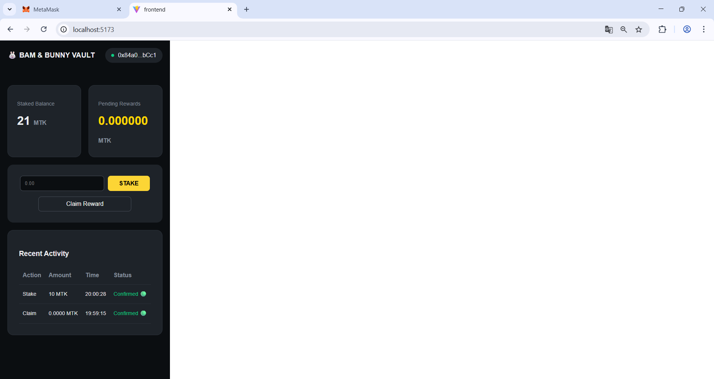

🐰 Bam & Bunny Staking Vault (DeFi DApp)
Project Overview
ระบบ Decentralized Finance (DeFi) บนเครือข่าย Sepolia Testnet ที่ช่วยให้ผู้ใช้งานสามารถนำเหรียญ MTK (MyToken) มาฝาก (Stake) เพื่อรับผลตอบแทนแบบ Real-time. โปรเจกต์นี้แสดงถึงการพัฒนาแบบ End-to-End ตั้งแต่การออกแบบ Smart Contract ไปจนถึงการสร้าง Modern Dashboard.

🚀 Key Features
Staking Mechanism: ระบบฝากเหรียญที่คำนวณรางวัลตามระยะเวลา (Block-based reward calculation).

Real-time Dashboard: แสดงผลยอดฝาก (Staked Balance) และรางวัลที่ได้รับ (Pending Rewards) แบบวินาทีต่อวินาที.

Transaction History: ระบบบันทึกประวัติธุรกรรมย้อนหลัง (Stake, Claim) เพื่อความโปร่งใสและตรวจสอบได้ (Transparency).

Responsive Dark Mode UI: อินเทอร์เฟซที่ใช้งานง่าย เน้นความปลอดภัยและเสถียรภาพของระบบ (System Stability).

🛠 Technology Stack
Smart Contracts: Solidity (OpenZeppelin Standards).

Development Framework: Hardhat (Deployment & Testing).

Frontend: React.js, Ethers.js.

Web3 Connectivity: MetaMask Integration.

Network: Ethereum Sepolia Testnet.

🖥️ How to Run
Clone the repo: git clone [your-repo-link]

Install dependencies: npm install

Run Frontend: cd frontend && npm run dev

Connect Wallet: เปลี่ยนเครือข่าย MetaMask เป็น Sepolia Testnet.

Deployed Contracts:

MyToken (MTK): 0x191d9F164F88412ddFCf65562a84e4771f050BE9

StakingVault: 0x445cCB48c2083dF6C2f58A46b2aC991E822654D5

